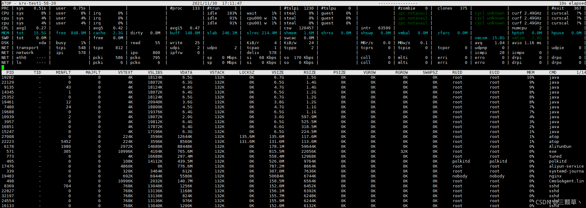

# 查看系统进程状态命令atop

### 一、atop简介
atop是一款用于监控Linux系统资源与进程的工具，它以一定的频率记录系统的运行状态，所采集的数据包含系统资源(CPU、内存、磁盘和网络)使用情况和进程运行情况，并能以日志文件的方式保存在磁盘中，服务器出现问题后，我们可获取相应的atop日志文件进行分析，其比较强大的地方是其支持我们分析数据时进行排序、视图切换、正则匹配等处理。

### 二、监控字段的含义
1、ATOP列：该列显示了主机名、信息采样日期和时间点

2、PRC列：该列显示进程整体运行情况

> 1. sys、usr字段分别指示进程在内核态和用户态的运行时间
> 2. #proc字段指示进程总数
> 3. #zombie字段指示僵死进程的数量
> 4. #exit字段指示atop采样周期期间退出的进程数量

3、CPU列：该列显示CPU整体(即多核CPU作为一个整体CPU资源)的使用情况，我们知道CPU可被用于执行进程、处理中断，也可处于空闲状态(空闲状态分两种，一种是活动进程等待磁盘IO导致CPU空闲，另一种是完全空闲)

> 1. sys、usr字段指示CPU被用于处理进程时，进程在内核态、用户态所占CPU的时间比例
> 2. irq字段指示CPU被用于处理中断的时间比例
> 3. idle字段指示CPU处在完全空闲状态的时间比例
> 4. wait字段指示CPU处在“进程等待磁盘IO导致CPU空闲”状态的时间比例

4、CPU列：各个字段指示值相加结果为N00%，其中N为cpu核数。

5、cpu列：该列显示某一核cpu的使用情况，各字段含义可参照CPU列，各字段值相加结果为100%

6、CPL列：该列显示CPU负载情况

> 1. avg1、avg5和avg15字段：过去1分钟、5分钟和15分钟内运行队列中的平均进程数量
> 2. csw字段指示上下文交换次数
> 3. intr字段指示中断发生次数

7、MEM列：该列指示内存的使用情况

> 1. tot字段指示物理内存总量
> 2. free字段指示空闲内存的大小
> 3. cache字段指示用于页缓存的内存大小
> 4. buff字段指示用于文件缓存的内存大小
> 5. slab字段指示系统内核占用的内存大小

8、SWP列：该列指示交换空间的使用情况

> 1. tot字段指示交换区总量
> 2. free字段指示空闲交换空间大小

9、PAG列：该列指示虚拟内存分页情况

> swin、swout字段：换入和换出内存页数

10、DSK列：该列指示磁盘使用情况，每一个磁盘设备对应一列，如果有sdb设备，那么增多一列DSK信息

> 1. sda字段：磁盘设备标识
> 2. busy字段：磁盘忙时比例
> 3. read、write字段：读、写请求数量

11、NET列：多列NET展示了网络状况，包括传输层(TCP和UDP)、IP层以及各活动的网口信息

> 1. XXXi  字段指示各层或活动网口收包数目
> 2. XXXo 字段指示各层或活动网口发包数目

### 三、视图模视与按键

1、默认视图(Generic information)

进入atop信息界面，我们看到的就是进程信息的默认视图(上图下半部分)，按g键可以从其他视图跳到默认视图。以简介里的截图为例，我们可以看到PID为31085的find进程在退出前在内核模式下占用了0.45秒CPU时间，在用户模式下占用了0.10秒CPU时间，相对10分钟采样周期，CPU时间占用比例为3%，ST列表示进程状态，N表示该进程是前一个采样周期新生成的进程，E表示该进程已退出，EXC列指示进程的退出码。从进程名在`<>`符号中，我们亦可知该进程已退出。

2、内存视图(Memory consumption)

内存视图展示了进程使用内存情况，按m键可进入内存视图。如下图：

上图下半部分展示了每个进程占用的虚拟内存空间(VSIZE)、内存空间(RSIZE)大小，以及在上一个采样周期中虚拟内存和物理内存增长大小(VGROW、RGROW)，MEM列指示进程所占物理内存大小。从上图的PAG列的信息，我们可以知道此时系统内存负载较高，页交换比较频繁，而且可以看出物理内存几乎完全不可用，swap分区也比较繁忙，从进程视图中VGROW和RGROW列可看出 lekker 进程占用内存量大量增长，部分进程占用的内存减少(VGROW或RGROW字段为负值)，为lekker进程腾出空间。

3、命令视图(Command line) 按c

这个对于查看具体某个命令的详细参数，很容易通过该模式下查看到。比如，我们有多个java程序，普通视图下，可能看到的只显示为java ，但通过命令模式，我们可以方便的区分出，到底是哪个java程序占用资源比较高。如下图：

 4、磁盘视图

通过按键d 可以进入磁盘视图，可以查看每个进程占用IO的情况。

5、快捷键汇总

读取atop日志文件： atop  -r  XXX

前进翻页： t

后退翻页： T

进程列表前进翻页： ctrl + f

进程列表后退翻页： ctrl + b

按时间跳转： b

 Enter new time (format hh:mm):

 按hh:mm格式输入时间

进程视图：

g   —— 默认输出

m  —— 内存相关输出

d   —— 磁盘相关输出

n   —— 网络相关输出

c   —— 命令行输出

u  查看对应的用户资源使用情况

p  显示所有每个进程的所有信息占用情况（disk、mem、io）

P（大写） 正则匹配，显示所有匹配到的进程

退出atop：q

