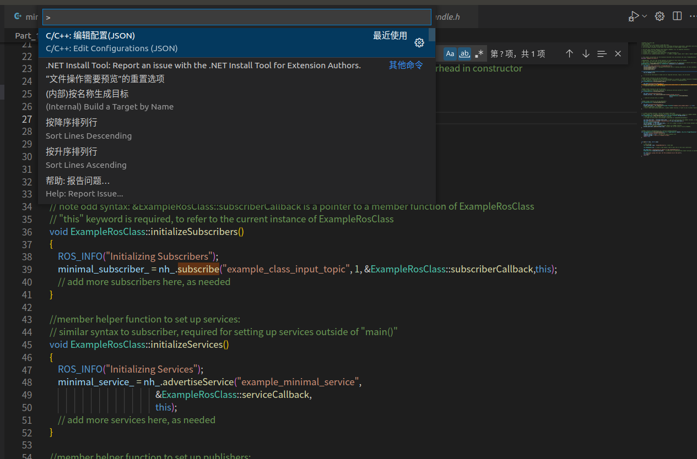

### vscode中配置或添加头文件路径

在vscode中按Ctrl+Shift+P 输入configuration 在c_cpp_properties.json中includePath字段中添加待添加的SDK或者库的头文件路径 例："/usr/local/xxx/include/"



```
{
    "configurations": [
        {
            "name": "Linux",
            "includePath": [
                "${workspaceFolder}/**",
                "/usr/local/xxx/include/"
            ],
            "defines": [],
            "compilerPath": "/usr/bin/gcc",
            "cStandard": "c11",
            "cppStandard": "c++17",
            "intelliSenseMode": "clang-x64"
        }
    ],
    "version": 4
}
```

重新打开文件
恩，可以点击跳转啦～
